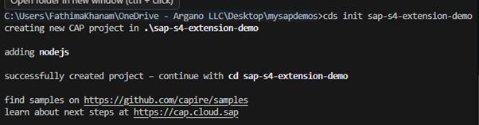
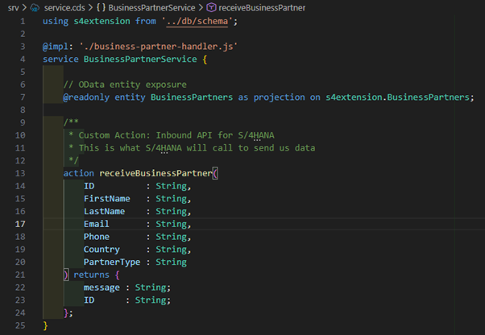

#  SAP CAP Extension for S/4HANA
# 📋 Project Overview
Project Name: cap-s4-extension-demo
Purpose: Build a side-by-side extension for S/4HANA to receive and manage Business Partner data
Technology Stack: SAP CAP, Node.js, SQLite, OData V4
Business Scenario: Receive Business Partner master data from S/4HANA system and expose it via REST API
________________________________________
📂 Project Structure

________________________________________
# 🛠️ Step-by-Step Development Process 
# STEP 1: Prerequisites Installation 
1.1 Install Node.js 
What: JavaScript runtime environment 
Why: Required to run SAP CAP applications 
Version: 20.x or higher 
Installation: 
1.	Download from: https://nodejs.org/
2.	Choose LTS (Long Term Support) version
3.	Run installer with default settings
4.	Restart computer after installation
Verification: 
node --version 

1.2 Install SAP CDS Development Kit 
What: SAP Cloud Application Programming Model tools 
Why: Provides cds command and development tools 
Installation: 
npm install -g @sap/cds-dk 
Verification: 
cds --version 
Expected output: Shows CDS version information 

# STEP 2: Create New CAP Project 
2.1 Create Project 
Open Terminal/Command Prompt: 
Navigate to your workspace (e.g., Desktop) 
cd Desktop 

Create new CAP project 
cds init cap-s4-extension-demo 

Navigate into project folder 
cd cap-s4-extension-demo 
What Happened: 
•	Created project folder structure 
•	Generated basic files (package.json, README.md) 
•	Created empty db/ and srv/ folders 

2.2 Open in VS Code 
Open project in VS Code 
code . 
What You See: 
•	File explorer with project structure 
•	Empty db/ and srv/ folders 
•	package.json file 

# STEP 3: Define Data Model
3.1 Create Schema File 
File: db/schema.cds 
Purpose: Define Business Partner entity structure 
Create the file: 
1.	Right-click on db folder
2.	Select "New File"
3.	Name it: schema.cds
Add this content: 
namespace s4extension; 

/** 
 * Business Partner Entity 
 * Stores master data received from S/4HANA 
 */ 
entity BusinessPartners { 
    key ID          : String(10);      // Unique Business Partner ID 
        FirstName   : String(100);     // First name 
        LastName    : String(100);     // Last name 
        Email       : String(150);     // Email address 
        Phone       : String(30);      // Phone number 
        Country     : String(3);       // Country code (ISO 3166-1 alpha-3) 
        PartnerType : String(20);      // Customer or Supplier 
        CreatedAt   : Timestamp;       // Record creation time 
        ModifiedAt  : Timestamp;       // Last modification time 
} 
Understanding the Code: 
Element     -   Explanation 
namespace   -   Logical grouping for entities (like a package) 
entity      -   Defines a database table 
key         -   Primary key field 
String(100)	-   Text field with max 100 characters 
Timestamp	-   Date and time field 
Save the file: Ctrl+S 

# STEP 4: Define Service API
4.1 Create Service Definition
File: srv/service.cds
Purpose: Expose OData API and define custom actions
Create the file:
1.	Right-click on srv folder
2.	Select "New File"
3.	Name it: service.cds
Add this content:
using s4extension from '../db/schema';

/**
 * Business Partner Service
 * Provides OData API and inbound integration endpoint
 */
@impl: './business-partner-handler.js'
service BusinessPartnerService {
    
    /**
     * OData Entity: Read-only access to Business Partners
     * External systems can query but not directly modify
     */
    @readonly 
    entity BusinessPartners as projection on s4extension.BusinessPartners;

    /**
     * Custom Action: Inbound API for S/4HANA
     * This is the endpoint S/4HANA calls to send Business Partner data
     * 
     * Input: Business Partner details as parameters
     * Output: Success message and ID
     */
    action receiveBusinessPartner(
        ID          : String,
        FirstName   : String,
        LastName    : String,
        Email       : String,
        Phone       : String,
        Country     : String,
        PartnerType : String
    ) returns {
        message : String;
        ID      : String;
    };
}
Understanding the Code:
Element	Explanation
using	Import entities from schema
@impl	Links service to handler JavaScript file
service	Creates an OData service
@readonly	Users can only read, not create/update/delete
projection	View of the entity
action	Custom operation (like a function call)
returns	Defines output structure
This Creates Endpoints:
•	GET /odata/v4/business-partner/BusinessPartners - Read all
•	GET /odata/v4/business-partner/BusinessPartners('BP001') - Read one
•	POST /odata/v4/business-partner/receiveBusinessPartner - Inbound API
Save the file: Ctrl+S
