#  SAP CAP Extension for S/4HANA
# 📋 Project Overview
Project Name: cap-s4-extension-demo
Purpose: Build a side-by-side extension for S/4HANA to receive and manage Business Partner data
Technology Stack: SAP CAP, Node.js, SQLite, OData V4
Business Scenario: Receive Business Partner master data from S/4HANA system and expose it via REST API
________________________________________
📂 Project Structure

________________________________________
# 🛠️ Step-by-Step Development Process 
# STEP 1: Prerequisites Installation 
1.1 Install Node.js 
What: JavaScript runtime environment 
Why: Required to run SAP CAP applications 
Version: 20.x or higher 
Installation: 
1.	Download from: https://nodejs.org/
2.	Choose LTS (Long Term Support) version
3.	Run installer with default settings
4.	Restart computer after installation
Verification: 
node --version 

1.2 Install SAP CDS Development Kit 
What: SAP Cloud Application Programming Model tools 
Why: Provides cds command and development tools 
Installation: 
npm install -g @sap/cds-dk 
Verification: 
cds --version 
Expected output: Shows CDS version information 

# STEP 2: Create New CAP Project 
2.1 Create Project 
Open Terminal/Command Prompt: 
Navigate to your workspace (e.g., Desktop) 
cd Desktop 

Create new CAP project 
cds init cap-s4-extension-demo 

Navigate into project folder 
cd cap-s4-extension-demo 
What Happened: 
•	Created project folder structure 
•	Generated basic files (package.json, README.md) 
•	Created empty db/ and srv/ folders 

2.2 Open in VS Code 
Open project in VS Code 
code . 
What You See: 
•	File explorer with project structure 
•	Empty db/ and srv/ folders 
•	package.json file 

# STEP 3: Define Data Model
3.1 Create Schema File 
File: db/schema.cds 
Purpose: Define Business Partner entity structure 
Create the file: 
1.	Right-click on db folder
2.	Select "New File"
3.	Name it: schema.cds
Add this content: 
namespace s4extension; 

/** 
 * Business Partner Entity 
 * Stores master data received from S/4HANA 
 */ 
entity BusinessPartners { 
    key ID          : String(10);      // Unique Business Partner ID 
        FirstName   : String(100);     // First name 
        LastName    : String(100);     // Last name 
        Email       : String(150);     // Email address 
        Phone       : String(30);      // Phone number 
        Country     : String(3);       // Country code (ISO 3166-1 alpha-3) 
        PartnerType : String(20);      // Customer or Supplier 
        CreatedAt   : Timestamp;       // Record creation time 
        ModifiedAt  : Timestamp;       // Last modification time 
} 
Understanding the Code: 
Element     -   Explanation 
namespace   -   Logical grouping for entities (like a package) 
entity      -   Defines a database table 
key         -   Primary key field 
String(100)	-   Text field with max 100 characters 
Timestamp	-   Date and time field 
Save the file: Ctrl+S 

# STEP 4: Define Service API
4.1 Create Service Definition  
File: srv/service.cds  
Purpose: Expose OData API and define custom actions  
Create the file:  
1.	Right-click on srv folder  
2.	Select "New File"  
3.	Name it: service.cds  
Add this content:  
using s4extension from '../db/schema';  

Understanding the Code: 
Element     -   Explanation 
using   	-   Import entities from schema 
@impl	    -   Links service to handler JavaScript file 
service	    -   Creates an OData service 
@readonly   -	Users can only read, not create/update/delete 
projection  -	View of the entity 
action      -	Custom operation (like a function call) 
returns     -	Defines output structure 
This Creates Endpoints: 
•	GET /odata/v4/business-partner/BusinessPartners - Read all 
•	GET /odata/v4/business-partner/BusinessPartners('BP001') - Read one 
•	POST /odata/v4/business-partner/receiveBusinessPartner - Inbound API 
Save the file: Ctrl+S 

# STEP 5: Implement Business Logic
## 5.1 Create Handler File 

File: `srv/business-partner-handler.js` 
Purpose: Implement custom action logic 

Create the file: 
1. Right-click on `srv` folder 
2. Select "New File" 
3. Name it: `business-partner-handler.js` 

Add this content: 
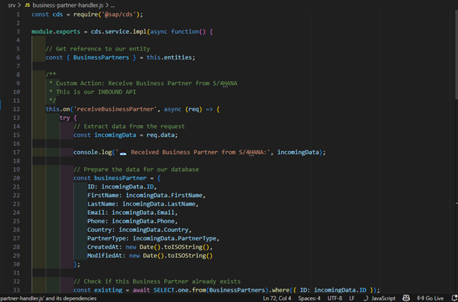
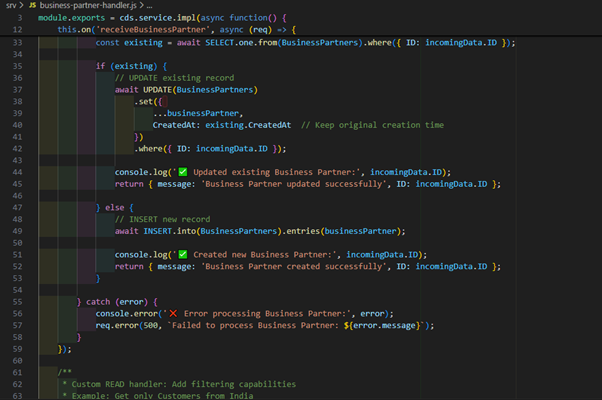
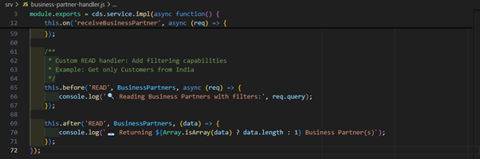
Understanding the Code: 

Key Concepts: 

1. Event Handlers: 
- `this.on('receiveBusinessPartner')` - Handles custom action 
- `this.before('READ')` - Runs before read operations 
- `this.after('READ')` - Runs after read operations 

2. CDS Query Language: 
- `SELECT.one.from()` - Query single record 
- `UPDATE().set().where()` - Update existing record 
- `INSERT.into().entries()` - Insert new record 

3. Upsert Pattern: 
- Check if record exists 
- If yes → Update 
- If no → Create 
- Common in integration scenarios 

4. Error Handling: 
- Try-catch block 
- Detailed error logging 
- Proper HTTP error responses 

Save the file: **Ctrl + S** 

# STEP 6: Configure Project Dependencies
## 6.1 Update package.json
File: package.json 
Purpose: Define project dependencies and database configuration 
Replace entire content with: 

Understanding the Configuration: 

Section — Explanation 
engines — Minimum Node.js version required 
dependencies — Runtime libraries (CAP, Express) 
devDependencies — Development-only libraries (SQLite) 
scripts — Command shortcuts 
cds.requires.db — Database configuration 

Key Configuration: 
• `"kind": "sqlite"` — Use SQLite database 
• `"database": "businesspartners.db"` — Database file name 
• This makes data persistent across server restarts 

Save the file: **Ctrl + S** 
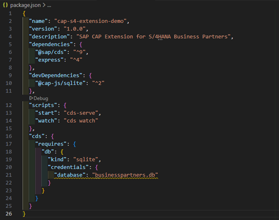

# STEP 7: Install Dependencies 

## 7.1 Install Node Modules 

Open Terminal in VS Code: 
• Press **Ctrl + `** (backtick key) 
• Or: Menu → Terminal → New Terminal 

Run installation command: 

bash
npm install

# STEP 8: Deploy Database Schema 

## 8.1 Create Database Tables 

Purpose: Transform CDS entities into actual database tables 

Run deployment command: 

bash
cds deploy --to sqlite:businesspartners.db

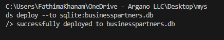

Verify Database Creation: 
Check that businesspartners.db file exists in project root: 

## 8.2 Verify Database Structure 

Optional: Check created tables 

Using VS Code Extension 

1. Ensure "SQLite Viewer" extension is installed 
2. Click on `businesspartners.db` file in VS Code 
3. Extension opens showing: 
&nbsp;&nbsp;o List of tables 
&nbsp;&nbsp;o Table structures 
&nbsp;&nbsp;o Empty data grids 

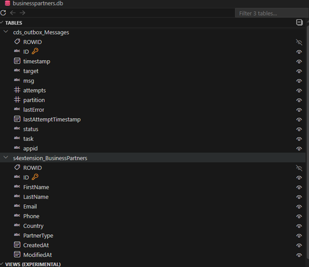
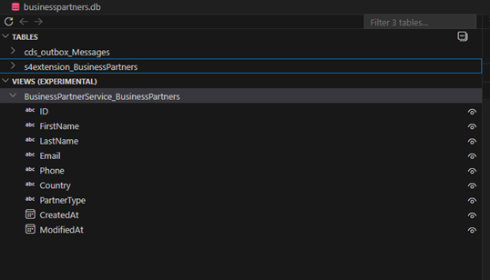

# STEP 9: Start the Application 

## 9.1 Start Development Server 

Run server command: 
cds watch 

What This Does: 

1. Compiles CDS models 
2. Connects to database 
3. Loads handler implementations 
4. Generates OData services 
5. Starts Express web server on port 4004 
6. Watches for file changes (auto-reload) 

Expected Output: 

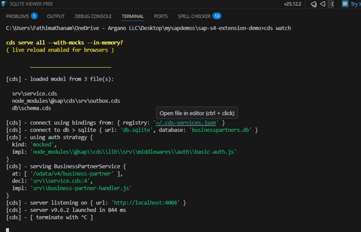

## 9.2 Verify Server is Running 
Open browser and navigate to: 
http://localhost:4004 
Expected Result: 
Welcome page showing: 
Welcome to cds.services 
 
BusinessPartnerService 
  /odata/v4/business-partner 

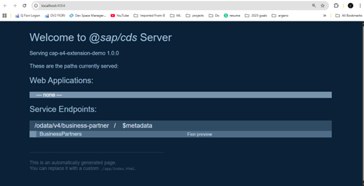
Test Service Metadata: 
Navigate to: 
http://localhost:4004/odata/v4/business-partner/$metadata 
Expected Result: 
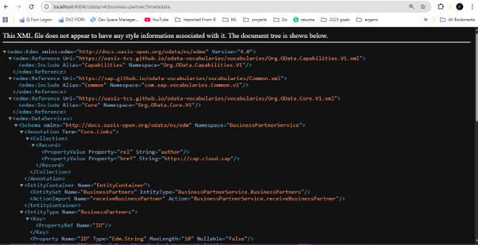

STEP 10: Create Test File 
10.1 Create HTTP Test Requests 
File: test-requests.http 
Purpose: Test API endpoints using REST Client extension 
Create file in project root: 
1. Right-click in Explorer (root level) 
2. New File 
3. Name: test-requests.http 
Add this content: & 
Testing the Application 
1. Test: Send Business Partner from S/4HANA (Create New) 
POST http://localhost:4004/odata/v4/business-partner/receiveBusinessPartner 
Content-Type: application/json 
 
{ 
  "ID": "BP001", 
  "FirstName": "Rajesh", 
  "LastName": "Kumar", 
  "Email": "rajesh.kumar@example.com", 
  "Phone": "+91-9876543210", 
  "Country": "IND", 
  "PartnerType": "Customer" 
} 

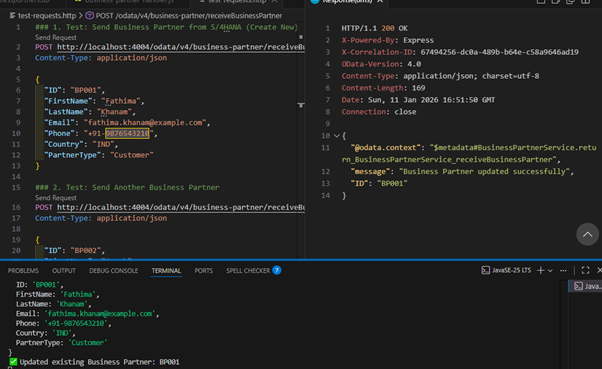
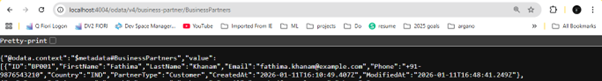

2. Test: Send Another Business Partner 
POST http://localhost:4004/odata/v4/business-partner/receiveBusinessPartner 
Content-Type: application/json 
{ 
  "ID": "BP002", 
  "FirstName": "Sarah", 
  "LastName": "Johnson", 
  "Email": "sarah.j@example.com", 
  "Phone": "+1-555-0123", 
  "Country": "USA", 
  "PartnerType": "Supplier" 
} 

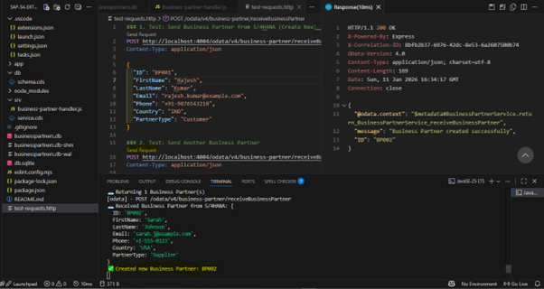
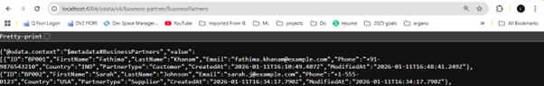

3. Test: Send Indian Supplier 
POST http://localhost:4004/odata/v4/business-partner/receiveBusinessPartner 
Content-Type: application/json 
 
{ 
  "ID": "BP003", 
  "FirstName": "Priya", 
  "LastName": "Sharma", 
  "Email": "priya.sharma@example.com", 
  "Phone": "+91-9988776655", 
  "Country": "IND", 
  "PartnerType": "Supplier" 
} 

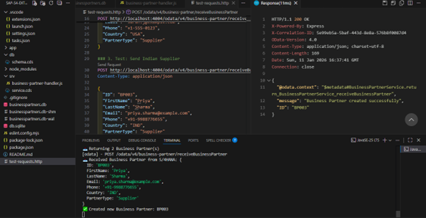
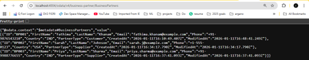

4. Test: Update Existing Business Partner (send BP001 again with changes) 
POST http://localhost:4004/odata/v4/business-partner/receiveBusinessPartner 
Content-Type: application/json 
 
{ 
  "ID": "BP001", 
  "FirstName": "Rajesh", 
  "LastName": "Kumar Updated", 
  "Email": "rajesh.new@example.com", 
  "Phone": "+91-9876543210", 
  "Country": "IND", 
  "PartnerType": "Customer" 
} 

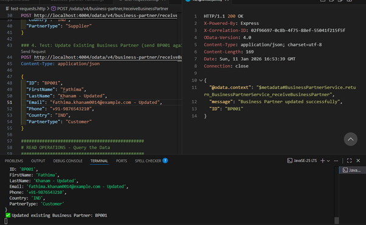
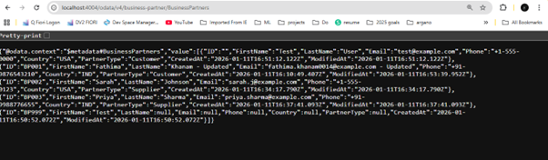

READ OPERATIONS - Query the Data 
5. Get All Business Partners 
GET http://localhost:4004/odata/v4/business-partner/BusinessPartners 
 

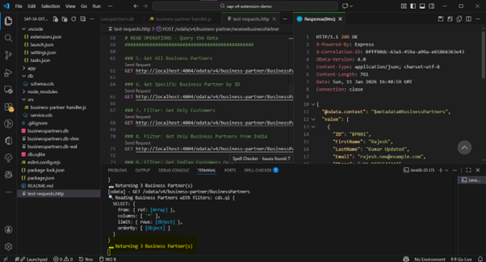
6. Get Specific Business Partner by ID 
GET http://localhost:4004/odata/v4/business-partner/BusinessPartners('BP001') 
 

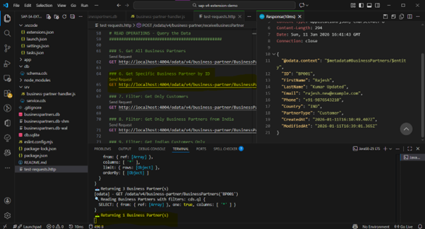

7. Filter: Get Only Customers 
GET http://localhost:4004/odata/v4/business-partner/BusinessPartners?$filter=PartnerType eq 'Customer' 
 

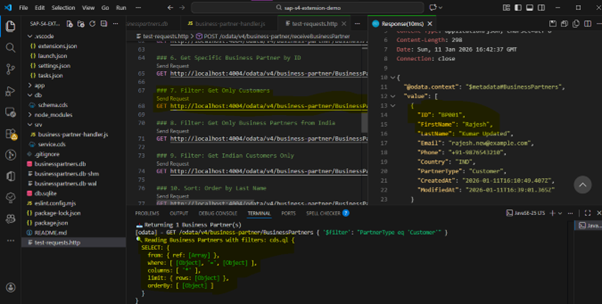

8. Filter: Get Only Business Partners from India 
GET http://localhost:4004/odata/v4/business-partner/BusinessPartners?$filter=Country eq 'IND' 
 

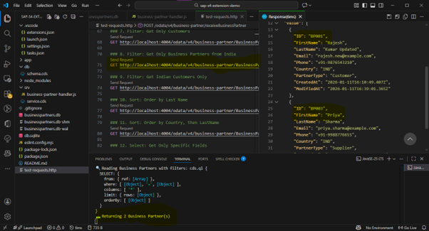
9. Filter: Get Indian Customers Only 
GET http://localhost:4004/odata/v4/business-partner/BusinessPartners?$filter=Country eq 'IND' and PartnerType eq 'Customer' 
 

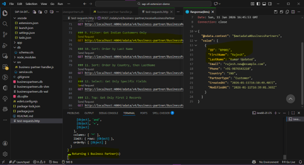

10. Sort: Order by Last Name 
GET http://localhost:4004/odata/v4/business-partner/BusinessPartners?$orderby=LastName 
 

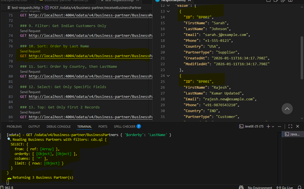

11. Sort: Order by Country, then LastName 
GET http://localhost:4004/odata/v4/business-partner/BusinessPartners?$orderby=Country,LastName 
 

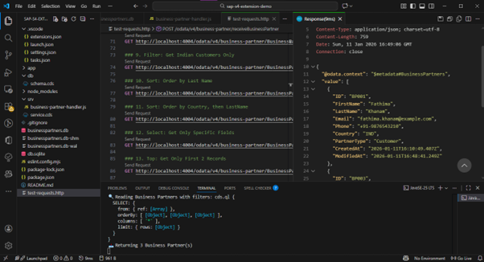

12. Select: Get Only Specific Fields 
GET http://localhost:4004/odata/v4/business-partner/BusinessPartners?$select=ID,FirstName,LastName,Country 
 

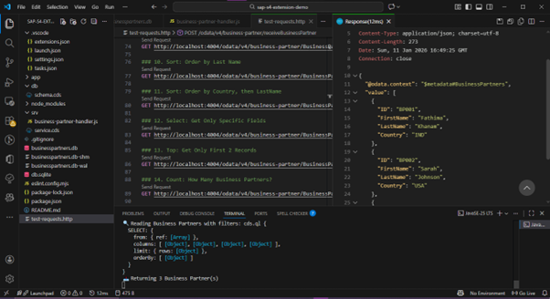

13. Top: Get Only First 2 Records 
GET http://localhost:4004/odata/v4/business-partner/BusinessPartners?$top=2 
 

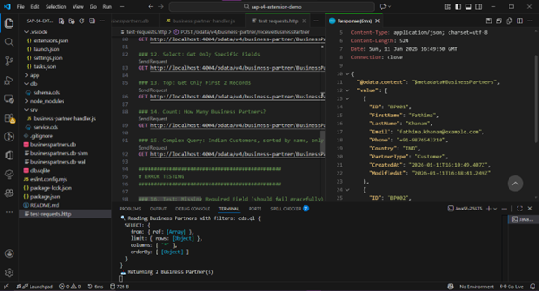

14. Count: How Many Business Partners? 
GET http://localhost:4004/odata/v4/business-partner/BusinessPartners/$count 
 

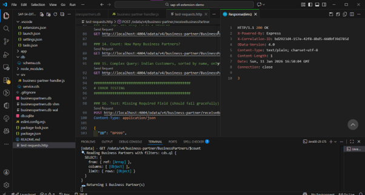

15. Complex Query: Indian Customers, sorted by name, only ID and Name 
GET http://localhost:4004/odata/v4/business-partner/BusinessPartners?$filter=Country eq 'IND' and PartnerType eq 'Customer'&$orderby=LastName&$select=ID,FirstName,LastName 
 

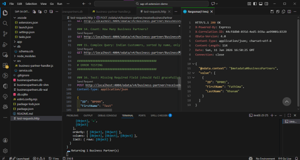

ERROR TESTING 
 
16. Test: Missing Required Field (should fail gracefully) 
POST http://localhost:4004/odata/v4/business-partner/receiveBusinessPartner 
Content-Type: application/json 
{ 
  "ID": "BP999", 
  "FirstName": "Test" 
} 
 

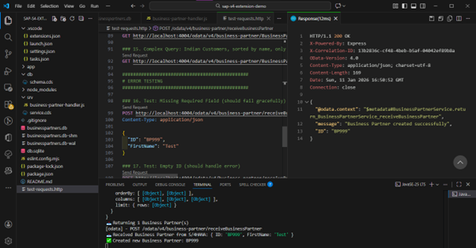

17. Test: Empty ID (should handle error) 
POST http://localhost:4004/odata/v4/business-partner/receiveBusinessPartner 
Content-Type: application/json 
{ 
  "ID": "", 
  "FirstName": "Test", 
  "LastName": "User", 
  "Email": "test@example.com", 
  "Phone": "+1-555-0000", 
  "Country": "USA", 
  "PartnerType": "Customer" 
} 

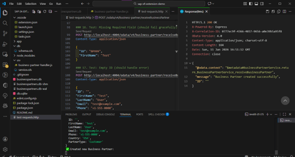

# STEP 12: Verify in Database 
12.1 Check Database Directly 
Method 1: Using SQLite Viewer Extension 
1. Click on businesspartners.db file in VS Code 
2. Extension opens showing database structure 
3. Click on table: s4extension_BusinessPartners 
4. View all records in grid format 

# STEP 13: Understanding OData Query Capabilities 
13.1 Filter Operations ($filter) 
Equals: 
$filter=Country eq 'IND' 
SQL equivalent: WHERE Country = 'IND' 
 
Not Equals: 
$filter=Country ne 'USA' 
SQL equivalent: WHERE Country != 'USA' 
 
Greater Than (for strings, alphabetically): 
$filter=ID gt 'BP002' 
SQL equivalent: WHERE ID > 'BP002' 
 
Multiple Conditions (AND): 
$filter=Country eq 'IND' and PartnerType eq 'Customer' 
SQL equivalent: WHERE Country = 'IND' AND PartnerType = 'Customer' 
 
Multiple Conditions (OR): 
$filter=Country eq 'IND' or Country eq 'USA' 
SQL equivalent: WHERE Country = 'IND' OR Country = 'USA' 
 
Contains (Substring Search): 
$filter=contains(LastName,'Kumar') 
SQL equivalent: WHERE LastName LIKE '%Kumar%' 
 
Starts With: 
$filter=startswith(Email,'rajesh') 
SQL equivalent: WHERE Email LIKE 'rajesh%' 
 
Ends With: 
$filter=endswith(Email,'example.com') 
SQL equivalent: WHERE Email LIKE '%example.com' 
 
13.2 Sorting ($orderby) 
Sort Ascending: 
$orderby=LastName 
SQL equivalent: ORDER BY LastName ASC 
 
Sort Descending: 
$orderby=LastName desc 
SQL equivalent: ORDER BY LastName DESC 
 
Sort by Multiple Fields: 
$orderby=Country,LastName 
SQL equivalent: ORDER BY Country ASC, LastName ASC 
13.3 Field Selection ($select) 
Select Specific Fields: 
$select=ID,FirstName,LastName 
SQL equivalent: SELECT ID, FirstName, LastName 
Benefits: 
• Reduces response size 
• Faster data transfer 
• Better performance 
 
13.4 Pagination 
Limit Results ($top): 
$top=5 
SQL equivalent: LIMIT 5 
Returns first 5 records. 
 
Skip Records ($skip): 
$skip=10 
SQL equivalent: OFFSET 10 
Skips first 10 records. 
 
Combine for Pagination: 
$skip=10&$top=5 
SQL equivalent: LIMIT 5 OFFSET 10 
Skips 10, returns next 5 (records 11-15). 
Use Case: Building paginated tables 
• Page 1: $skip=0&$top=10 
• Page 2: $skip=10&$top=10 
• Page 3: $skip=20&$top=10 
 
13.5 Count Records ($count) 
Get Total Count: 
/BusinessPartners/$count 
Response: 
3 
Just a number, not JSON. 
 
13.6 Combining Multiple Operations 
Complex Query Example: 
GET /BusinessPartners 
  ?$filter=Country eq 'IND' and PartnerType eq 'Customer' 
  &$orderby=LastName desc 
  &$select=ID,FirstName,LastName,Email,Phone 
  &$top=10 
  &$skip=0 
This Query: 
1. Filters: Indian Customers only 
2. Sorts: By LastName descending 
3. Selects: Only 5 fields 
4. Limits: First 10 results 
5. Pagination: Starting from record 0 
Use Case: Building a filtered, sorted, paginated table in UI 
 
STEP 14: How the Application Works 
14.1 Request Flow - CREATE Operation 
Step-by-Step Flow: 
1. HTTP POST Request Arrives 
   ↓ 
   URL: /odata/v4/business-partner/receiveBusinessPartner 
   Body: { "ID": "BP001", "FirstName": "Rajesh", ... } 
 
2. CAP Framework Routes Request 
   ↓ 
   Identifies: receiveBusinessPartner action 
   Finds: @impl annotation pointing to handler file 
 
3. Handler Function Executes 
   ↓ 
   this.on('receiveBusinessPartner', async (req) => { ... }) 
   Extracts: req.data 
 
4. Data Preparation 
   ↓ 
   Creates businessPartner object with timestamps 
 
5. Database Check 
   ↓ 
   SELECT.one.from(BusinessPartners).where({ ID: 'BP001' }) 
   Result: null (doesn't exist) 
 
6. Insert Operation 
   ↓ 
   INSERT.into(BusinessPartners).entries(businessPartner) 
   SQLite executes: INSERT INTO s4extension_BusinessPartners VALUES (...) 
 
7. Return Success 
   ↓ 
   Returns: { message: "Business Partner created successfully", ID: "BP001" } 
 
8. HTTP Response Sent 
   ↓ 
   Status: 200 OK 
   Body: { "message": "...", "ID": "BP001" } 
 
14.2 Request Flow - UPDATE Operation (Upsert) 
Step-by-Step Flow: 
1. HTTP POST Request Arrives 
   ↓ 
   Same endpoint, but ID already exists: BP001 
 
2-4. Same as Create Flow 
   ↓ 
 
5. Database Check 
   ↓ 
   SELECT.one.from(BusinessPartners).where({ ID: 'BP001' }) 
   Result: { ID: 'BP001', ... } (exists!) 
 
6. Update Operation 
   ↓ 
   UPDATE(BusinessPartners) 
     .set({ ...businessPartner, CreatedAt: existing.CreatedAt }) 
     .where({ ID: 'BP001' }) 
   SQLite executes: UPDATE s4extension_BusinessPartners SET ... WHERE ID = 'BP001' 
 
7. Return Success 
   ↓ 
