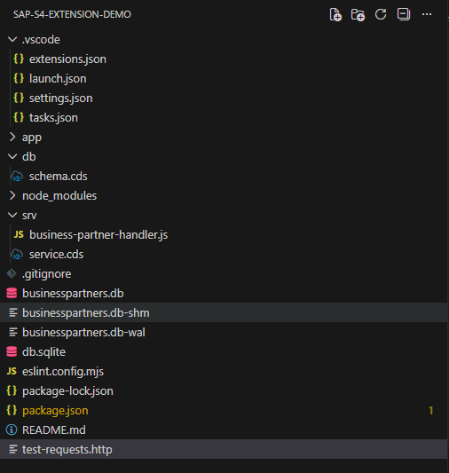
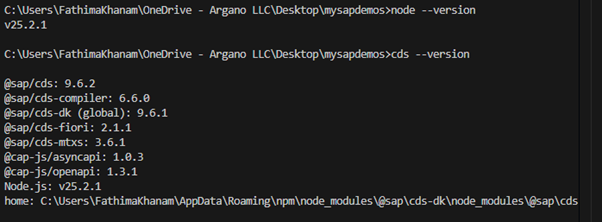

SAP CAP Extension for S/4HANA
📋 Project Overview
Project Name: cap-s4-extension-demo
Purpose: Build a side-by-side extension for S/4HANA to receive and manage Business Partner data
Technology Stack: SAP CAP, Node.js, SQLite, OData V4
Business Scenario: Receive Business Partner master data from S/4HANA system and expose it via REST API
________________________________________
📂 Project Structure

________________________________________
🛠️ Step-by-Step Development Process
STEP 1: Prerequisites Installation
1.1 Install Node.js
What: JavaScript runtime environment
Why: Required to run SAP CAP applications
Version: 20.x or higher
Installation:
1.	Download from: https://nodejs.org/
2.	Choose LTS (Long Term Support) version
3.	Run installer with default settings
4.	Restart computer after installation
Verification:
node --version
# Expected output: v20.x.x or higher
1.2 Install SAP CDS Development Kit
What: SAP Cloud Application Programming Model tools
Why: Provides cds command and development tools
Installation:
npm install -g @sap/cds-dk
Verification:
cds --version
# Expected output: Shows CDS version information
